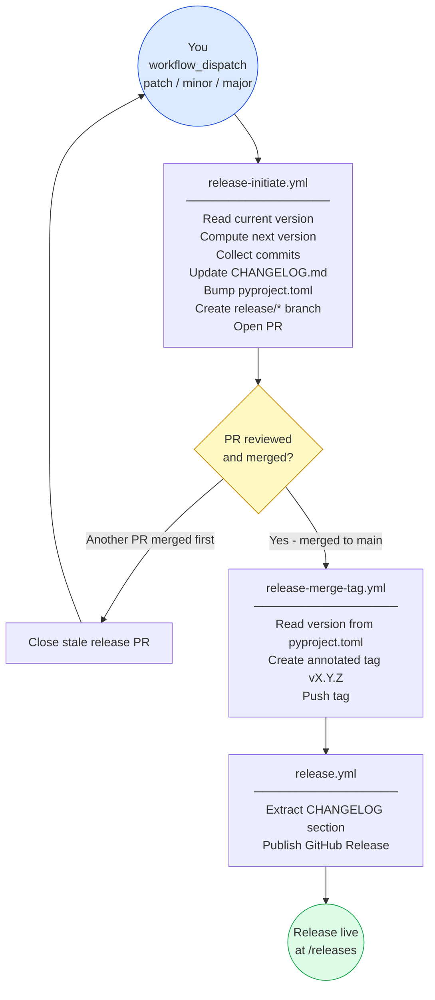

# Release Instructions

This document describes the full release process for
`guidance-for-claude-code-with-amazon-bedrock`. Releases follow
[Semantic Versioning](https://semver.org/spec/v2.0.0.html) and are published as
[GitHub Releases](https://github.com/aws-solutions-library-samples/guidance-for-claude-code-with-amazon-bedrock/releases).

---

## Prerequisites

- Write access to the repository
- GitHub CLI (`gh`) installed locally (optional — only needed if you want to trigger from terminal)
- A `RELEASE_TOKEN` repository secret set to a Personal Access Token (PAT) with `repo` scope

> **Why a PAT?**
> GitHub Actions' built-in `GITHUB_TOKEN` cannot trigger downstream workflows.
> When `release-merge-tag.yml` pushes a tag, `release.yml` must be triggered by
> that push — this only works if the push was authenticated with a PAT or GitHub
> App token. Without `RELEASE_TOKEN`, the tag is created but the GitHub Release
> must be published manually.
>
> To create the PAT: **GitHub → Settings → Developer settings → Personal access
> tokens → Fine-grained tokens → New token**
> Required permissions: `Contents: Read and write`, `Pull requests: Read and write`
> Then add it at: **Repo → Settings → Secrets and variables → Actions →
> New repository secret** → name it `RELEASE_TOKEN`.

---

## Workflow overview

Three workflows work together in sequence:

```
You (manual)
    │
    ▼
release-initiate.yml        ← you trigger this
    │  Reads current version from source/pyproject.toml
    │  Computes next version (based on your choice)
    │  Collects commits since last release
    │  Inserts new section into CHANGELOG.md
    │  Bumps version in source/pyproject.toml
    │  Opens PR: "chore: release vX.Y.Z (patch|minor|major)"
    ▼
PR reviewed & merged to main (you)
    │
    ▼
release-merge-tag.yml       ← auto, triggers on PR merge
    │  Reads version from source/pyproject.toml
    │  Creates annotated git tag vX.Y.Z
    │  Pushes tag to repository
    ▼
release.yml                 ← auto, triggers on tag push
       Extracts [X.Y.Z] section from CHANGELOG.md
       Publishes GitHub Release with those notes
       Release visible at /releases
```

---

## Step-by-step guide

### Step 1 — Decide the release type

Before triggering the workflow, decide which semver component to bump:

| Type | When to use | Example |
|---|---|---|
| `patch` | Bug fixes only, no new features, no breaking changes | `2.1.0` → `2.1.1` |
| `minor` | New features added, fully backward compatible | `2.1.0` → `2.2.0` |
| `major` | Breaking changes — existing behaviour removed or changed | `2.1.0` → `3.0.0` |

**No algorithm decides this** — you choose based on what changed. When in doubt, look at the merged PRs since the last release and apply [semver rules](https://semver.org).

---

### Step 2 — Trigger the release initiation workflow

**Option A — GitHub UI (recommended):**

1. Go to the repository on GitHub
2. Click **Actions** in the top navigation
3. Select **Release Initiate** from the left sidebar
4. Click **Run workflow** (top right of the workflow list)
5. Choose the release type from the dropdown: `patch`, `minor`, or `major`
6. Click **Run workflow**

**Option B — GitHub CLI:**

```bash
gh workflow run release-initiate.yml \
  --repo aws-solutions-library-samples/guidance-for-claude-code-with-amazon-bedrock \
  --ref main \
  --field release_type=patch
```

Replace `patch` with `minor` or `major` as needed.

---

### Step 3 — What the workflow does automatically

After you click **Run workflow**, the `release-initiate.yml` workflow:

1. **Reads** the current version from `source/pyproject.toml` (e.g. `2.1.0`)
2. **Computes** the next version (e.g. patch → `2.1.1`)
3. **Collects** all commits since the last published release, grouped by conventional-commit prefix:
   - `feat:` commits → **Added** section
   - `fix:` commits → **Fixed** section
   - `refactor:` / `perf:` commits → **Changed** section
   - `chore:` / `ci:` / `docs:` commits → **Other** section
4. **Inserts** a new `## [2.1.1] - YYYY-MM-DD` section at the top of `CHANGELOG.md`
5. **Bumps** `version = "2.1.1"` in `source/pyproject.toml`
6. **Creates** a branch named `release/YYYY.MM.YYYYMMDDhhmmss`
7. **Opens** a pull request titled `chore: release v2.1.1 (patch)`
8. **Closes** any previously open stale release PRs

The entire process takes ~60 seconds.

---

### Step 4 — Review and edit the release PR

Open the pull request that was just created. It contains exactly **two changed files**:

**`source/pyproject.toml`**
```diff
-version = "2.1.0"
+version = "2.1.1"
```

**`CHANGELOG.md`** (new section prepended)
```diff
+## [2.1.1] - 2026-03-27
+
+### Added
+- Add Claude Opus 4.6 model support
+- Add ALB JWT validation for OTEL Collector endpoint
+
+### Fixed
+- Add two-layer caching to otel-helper to eliminate telemetry UI freezes
+- Use configured inference profile for test instead of hardcoded model IDs
+- Auth0 JWT issuer trailing slash
+
+### Other
+- Add GitHub security scanning workflows (bandit, semgrep, cfn_nag, scanners)
+
 ## [2.1.0] - 2026-03-20
```

**Before merging:**

- [ ] Read through the auto-generated CHANGELOG section and clean up wording
- [ ] Remove any `chore:` / `ci:` entries that are not relevant to users
- [ ] Add any context that commit messages lacked (e.g. link to PR numbers)
- [ ] Confirm the version bump is the correct type for the changes
- [ ] Wait for all CI checks to pass (scanners, bandit, cfn_nag, semgrep)

You can push additional commits to the `release/*` branch to refine the notes before merging.

---

### Step 5 — Merge the PR

Once the release notes look good and all checks pass:

1. Get at least one code owner approval (per `CODEOWNERS`)
2. Merge the PR using **Squash and merge** or **Merge commit** (either is fine)
3. Do **not** close or delete the PR without merging — that will not trigger the tag step

---

### Step 6 — Tag is created automatically

`release-merge-tag.yml` fires within seconds of the merge. It:

1. Reads `version = "2.1.1"` from `source/pyproject.toml` on the merged commit
2. Validates that tag `v2.1.1` does not already exist
3. Creates an annotated tag: `git tag -a v2.1.1 -m "Release 2.1.1"`
4. Pushes `v2.1.1` to the repository

You can watch progress at **Actions → Release Merged (tag)**.

---

### Step 7 — GitHub Release is published automatically

`release.yml` fires when the `v2.1.1` tag is pushed. It:

1. Validates the tag format matches `vMAJOR.MINOR.PATCH`
2. Extracts the `## [2.1.1]` section from `CHANGELOG.md`
3. Creates a **GitHub Release** titled `Release v2.1.1` with those notes

The release is immediately visible at:
`https://github.com/aws-solutions-library-samples/guidance-for-claude-code-with-amazon-bedrock/releases`

You can watch progress at **Actions → Release (publish)**.

---

## Where release notes are published

All release notes are published to the **GitHub Releases page** only:

```
https://github.com/aws-solutions-library-samples/guidance-for-claude-code-with-amazon-bedrock/releases
```

The content of each release is taken directly from the matching `## [X.Y.Z]` section
in `CHANGELOG.md`. Whatever you write in that section during Step 4 is exactly what
appears on the releases page — no separate template or configuration needed.

This repo does **not** publish to PyPI, NPM, or any package registry as part of the
release workflow.

---

## What happens if another PR is merged while a release PR is open

If someone merges a feature or fix PR to `main` while a release PR is open,
`release-merge-tag.yml` automatically closes the stale release PR with a comment
explaining why. You must then re-run **Release Initiate** to create a fresh release
PR that includes the newly merged changes.

This prevents a release from being cut against a stale diff.

---

## Troubleshooting

### Release Initiate fails — "version not found in source/pyproject.toml"

The workflow reads `version = "X.Y.Z"` from `source/pyproject.toml`. If that line
is missing or malformed, the workflow exits. Fix the version line in `pyproject.toml`
and re-run.

### Release Merged (tag) fails — "Tag vX.Y.Z already exists"

A tag for this version was already pushed (perhaps from a previous attempt). Options:
- If the previous release was published correctly, no action needed — the release is done
- If you need to re-release, manually delete the tag and the GitHub Release, then re-merge

```bash
git push --delete origin vX.Y.Z
gh release delete vX.Y.Z --repo aws-solutions-library-samples/guidance-for-claude-code-with-amazon-bedrock
```

### release.yml does not trigger after the tag is pushed

This happens when `RELEASE_TOKEN` is not set and the tag was pushed using the
built-in `GITHUB_TOKEN`. The `GITHUB_TOKEN` cannot trigger downstream workflows.

**Fix:** Create a PAT as described in Prerequisites, add it as `RELEASE_TOKEN`, then
manually publish the release:

```bash
gh release create vX.Y.Z \
  --repo aws-solutions-library-samples/guidance-for-claude-code-with-amazon-bedrock \
  --title "Release vX.Y.Z" \
  --generate-notes
```

### The auto-generated CHANGELOG section is empty or wrong

The workflow groups commits by [conventional commit](https://www.conventionalcommits.org/)
prefix (`feat:`, `fix:`, `chore:`, etc.). If commits in this repo do not follow that
convention, they will fall into the uncategorised bucket or be omitted. Edit the
CHANGELOG section in the PR before merging — it is just a text file.

---

## Workflow diagram


