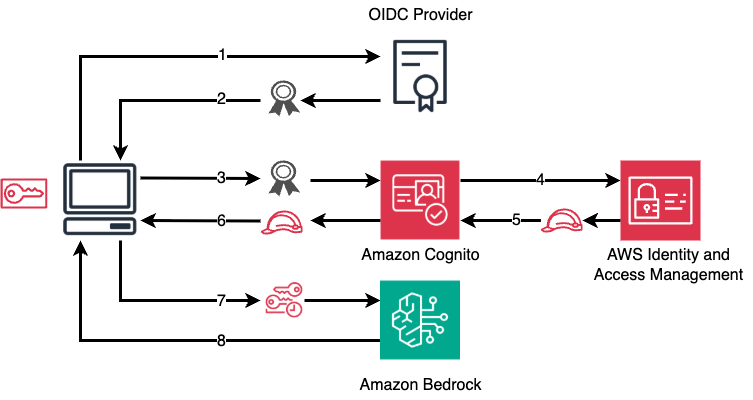
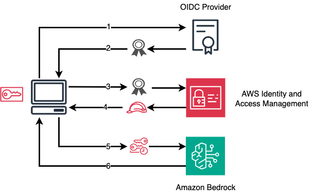

# Guidance for Claude Code with Amazon Bedrock

This guidance enables organizations to provide secure, centralized access to Claude models through Amazon Bedrock using existing enterprise identity providers. By integrating with OIDC providers like Okta, Azure AD, and Auth0, organizations can maintain their current authentication workflows while giving users seamless access to Claude Code without managing individual API keys.

## Key Features

### For Organizations

- **Enterprise SSO Integration**: Leverage existing OIDC identity providers (Okta, Azure AD, Auth0, etc.)
- **Centralized Access Control**: Manage Claude Code access through your identity provider
- **No API Key Management**: Eliminate the need to distribute or rotate long-lived credentials
- **Comprehensive Audit Trail**: Full CloudTrail logging of all Bedrock access
- **Usage Monitoring**: Optional CloudWatch dashboards for tracking usage and costs
- **Multi-Region Support**: Configure which AWS regions users can access Bedrock in
- **Multi-Platform Support**: Windows, macOS (ARM & Intel), and Linux distributions

### For End Users

- **Seamless Authentication**: Log in with corporate credentials
- **Automatic Credential Refresh**: No manual token management required
- **AWS CLI/SDK Integration**: Works with any AWS tool or SDK
- **Secure Credential Storage**: Choice of OS keyring or session-based storage
- **Multi-Profile Support**: Manage multiple authentication profiles
- **Cross-Platform**: Works on Windows, macOS, and Linux

## Table of Contents

1. [Quick Start](#quick-start)
2. [Enterprise Authentication Pattern](#enterprise-authentication-pattern)
3. [Architecture Overview](#architecture-overview)
4. [Prerequisites](#prerequisites)
5. [Implementation](#implementation)
6. [End User Experience](#end-user-experience)
7. [Monitoring and Operations](#monitoring-and-operations)
8. [Best Practices](#best-practices)
9. [CLI Commands](#cli-commands)
10. [Additional Resources](#additional-resources)

## Quick Start

### Prerequisites

See [Prerequisites](#prerequisites) including setting up [supported OIDC providers](#supported-oidc-providers).

### Getting started

1. Deploy guidance resources to your AWS account by executing the commands below.

```bash
# Clone the repository
git clone https://github.com/aws-solutions-library-samples/guidance-for-claude-code-with-amazon-bedrock
cd guidance-for-claude-code-with-amazon-bedrock/source

# Install dependencies
poetry install

# Run interactive setup wizard
poetry run ccwb init

# Deploy infrastructure
poetry run ccwb deploy

# Create distribution package for users (all platforms)
poetry run ccwb package --target-platform=all

# Create and distribute package via secure URL (Optional)
poetry run ccwb distribute
```

2. Test package locally to verify end-user installation and access to Amazon Bedrock.

```bash
# Test package locally
poetry run ccwb test
```

3. Distribute package to end-users (optional).

```bash
# Generate secure distribution URL (expires in 48 hours)
poetry run ccwb distribute

# Or specify custom expiration
poetry run ccwb distribute --expires-hours=72
```

4. Share the generated URL with developers - no AWS credentials required for download.

### Cleanup

You are responsible for the [costs](#cost) of AWS services while running this guidance. If you decide that you no longer need the guidance, please ensure that infrastructure resources are removed.

```
poetry run ccwb destroy
```

## How it works

This guidance implements an Enterprise Authentication Pattern that enables organizations to securely integrate Claude Code with their existing identity infrastructure. The pattern provides:

- **OIDC Identity Provider Integration**: Seamless authentication through Okta, Azure AD, Auth0, and other OIDC-compliant providers
- **Temporary AWS Credentials**: Eliminates long-lived credentials by providing session-based access to Amazon Bedrock
- **Centralized Access Control**: Manage Claude Code access through your existing identity provider groups and policies
- **Comprehensive Audit Logging**: Full CloudTrail integration for compliance and security monitoring
- **Optional Usage Monitoring**: CloudWatch dashboards with metrics for tracking Claude Code usage, costs, and performance across your organization

Step-by-step flow for end-users:

1. Users authenticate with their corporate credentials through your OIDC provider
2. The OIDC token is exchanged for temporary AWS credentials via Amazon Cognito
3. Claude Code uses these temporary credentials to access Amazon Bedrock
4. All access is logged and can be monitored through CloudWatch (if enabled)

## Architecture Overview

### Authentication Flow (with Cognito Identity Pool)



1. **User initiates authentication**: User requests access to Amazon Bedrock through Claude Code
2. **OIDC authentication**: User authenticates with their OIDC provider and receives an ID token
3. **Token submission to Cognito**: Application sends the OIDC ID token to Amazon Cognito
4. **Cognito requests AWS credentials**: Cognito exchanges the token with AWS IAM
5. **IAM returns credentials**: AWS IAM validates and returns temporary AWS credentials
6. **Cognito returns credentials**: Cognito passes the temporary credentials back to the application
7. **Access Amazon Bedrock**: Application uses the temporary credentials to call Amazon Bedrock
8. **Bedrock response**: Amazon Bedrock processes the request and returns the response

### Authentication Flow (direct to IAM)



1. **User initiates authentication**: User requests access to Amazon Bedrock through Claude Code
2. **OIDC authentication**: User authenticates with their OIDC provider and receives an ID token
3. **Token submission to IAM**: Application sends the OIDC ID token to Amazon Cognito
4. **IAM returns credentials**: AWS IAM validates and returns temporary AWS credentials
5. **Access Amazon Bedrock**: Application uses the temporary credentials to call Amazon Bedrock
6. **Bedrock response**: Amazon Bedrock processes the request and returns the response

### Cost

_You are responsible for the cost of the AWS services used while running this guidance._

### Sample Cost Table

The following table provides a sample cost breakdown for deploying this guidance with 5,000 monthly active users in the US East (N. Virginia) Region for one month (monitoring, analytics, and Windows builds would be separate).

| AWS service            | Dimensions                 | Cost [USD] |
| ---------------------- | -------------------------- | ---------- |
| **Total monthly cost** | 5,000 monthly active users | **$74.25** |

Based on AWS Pricing Calculator: [View Detailed Estimate](https://calculator.aws/#/estimate?id=df630701f37a3ab19cae0ebfa75eb33c86d7b31a)

## Prerequisites

### For Deployment (IT Administrators)

**Software Requirements:**

- Python 3.10-3.13
- Poetry (dependency management)
- AWS CLI v2
- Git

**AWS Requirements:**

- AWS account with appropriate IAM permissions to create:
  - CloudFormation stacks
  - IAM OIDC Providers or Cognito Identity Pools
  - IAM roles and policies
  - (Optional) Amazon Elastic Container Service (Amazon ECS) tasks and Amazon CloudWatch dashboards
  - (Optional) Amazon Athena, AWS Glue, AWS Lambda, and Amazon Data Firehose resources
  - (Optional) AWS CodeBuild
- Amazon Bedrock activated in target regions

**OIDC Provider Requirements:**

- Existing OIDC identity provider (Okta, Azure AD, Auth0, etc.)
- Ability to create OIDC applications
- Redirect URI support for `http://localhost:8400/callback`

### For End Users

**Software Requirements:**

- AWS CLI v2 or any AWS SDK
- Web browser for authentication
- macOS, Linux, or Windows operating system

**No AWS account required** - users authenticate through the organization's identity provider and receive temporary credentials.

### Supported AWS Regions

The guidance can be deployed in any AWS region that supports:

- IAM OIDC Providers or Amazon Cognito Identity Pools
- Amazon Bedrock
- (Optional) Amazon Elastic Container Service (Amazon ECS) tasks and Amazon CloudWatch dashboards
- (Optional) Amazon Athena, AWS Glue, AWS Lambda, and Amazon Data Firehose resources
- (Optional) AWS CodeBuild

### Cross-Region Inference

Claude Code uses Amazon Bedrock's cross-region inference for optimal performance and availability. During setup, you can:

- Select your preferred Claude model (Opus, Sonnet, Haiku)
- Choose a cross-region profile (US, Europe, APAC) for optimal regional routing
- Select a specific source region within your profile for model inference

This automatically routes requests across multiple AWS regions to ensure the best response times and highest availability. Modern Claude models (3.7+) require cross-region inference for access.

### Platform Support

The authentication tools support all major platforms:

| Platform | Architecture          | Build Method                | Installation |
| -------- | --------------------- | --------------------------- | ------------ |
| Windows  | x64                   | AWS CodeBuild (Nuitka)      | install.bat  |
| macOS    | ARM64 (Apple Silicon) | Native (PyInstaller)        | install.sh   |
| macOS    | Intel (x86_64)        | Cross-compile (PyInstaller) | install.sh   |
| macOS    | Universal (both)      | Universal2 (PyInstaller)    | install.sh   |
| Linux    | x86_64                | Docker (PyInstaller)        | install.sh   |
| Linux    | ARM64                 | Docker (PyInstaller)        | install.sh   |

**Build Requirements:**

- **Windows**: AWS CodeBuild with Nuitka (automated)
- **macOS**: PyInstaller with architecture-specific builds
  - ARM64: Native build on Apple Silicon Macs
  - Intel: Optional - requires x86_64 Python environment on ARM Macs
  - Universal: Requires both architectures' Python libraries
- **Linux**: Docker with PyInstaller (for building on non-Linux hosts)

### Optional: Intel Mac Builds

Intel Mac builds require an x86_64 Python environment on Apple Silicon Macs.
See [CLI Reference](assets/docs/CLI_REFERENCE.md#intel-mac-build-setup-optional) for setup instructions.

If not configured, the package command will skip Intel builds and continue with other platforms.

## Implementation

### Step 1: Initialize Configuration

Run the interactive setup wizard:

```bash
poetry run ccwb init
```

The wizard will guide you through:

- OIDC provider configuration (domain, client ID)
- AWS region selection for infrastructure
- Amazon Bedrock cross-region inference configuration
- Credential storage method (keyring or session files)
- Optional monitoring setup with VPC configuration

### Step 2: Deploy Infrastructure

Deploy the AWS CloudFormation stacks:

```bash
poetry run ccwb deploy
```

This creates the following AWS resources:

**Authentication Infrastructure:**

- IAM OIDC Provider or Amazon Cognito Identity Pool for OIDC federation
- IAM trust relationship for federated access
- IAM role with policies for:
  - Bedrock model invocation in specified regions
  - CloudWatch metrics (if monitoring enabled)

**Optional Monitoring Infrastructure:**

- VPC and networking resources (or integration with existing VPC)
- ECS Fargate cluster running OpenTelemetry collector
- Application Load Balancer for OTLP ingestion
- CloudWatch Log Groups and Metrics
- CloudWatch Dashboard with comprehensive usage analytics
- DynamoDB table for metrics aggregation and storage
- Lambda functions for custom dashboard widgets
- Kinesis Data Firehose for streaming metrics to S3 (if analytics enabled)
- Amazon Athena for SQL analytics on collected metrics (if analytics enabled)
- S3 bucket for long-term metrics storage (if analytics enabled)

### Step 3: Create Distribution Package

Build the package for end users:

```bash
# Build all platforms (starts Windows build in background)
poetry run ccwb package --target-platform all

# Check Windows build status (optional)
poetry run ccwb builds

# When ready, create distribution URL (optional)
poetry run ccwb distribute
```

**Package Workflow:**

1. **Local builds**: macOS/Linux executables are built locally using PyInstaller
2. **Windows builds**: Trigger AWS CodeBuild for Windows executables (20+ minutes) - requires enabling CodeBuild during `init`
3. **Check status**: Monitor build progress with `poetry run ccwb builds`
4. **Create distribution**: Use `distribute` to upload and generate presigned URLs

> **Note**: Windows builds are optional and require CodeBuild to be enabled during the `init` process. If not enabled, the package command will skip Windows builds and continue with other platforms.

The `dist/` folder will contain:

- `credential-process-macos-arm64` - Authentication executable for macOS ARM64
- `credential-process-macos-intel` - Authentication executable for macOS Intel (if built)
- `credential-process-windows.exe` - Authentication executable for Windows
- `credential-process-linux` - Authentication executable for Linux (if built on Linux)
- `config.json` - Embedded configuration
- `install.sh` - Installation script for Unix systems
- `install.bat` - Installation script for Windows
- `README.md` - User instructions
- `.claude/settings.json` - Claude Code telemetry settings (if monitoring enabled)
- `otel-helper-*` - OTEL helper executables for each platform (if monitoring enabled)

The package builder:

- Automatically builds binaries for both macOS and Linux by default
- Uses Docker for cross-platform Linux builds when running on macOS
- Includes the OTEL helper for extracting user attributes from JWT tokens
- Creates a unified installer that auto-detects the user's platform

### Step 4: Test the Setup

Verify everything works correctly:

```bash
poetry run ccwb test
```

This will:

- Simulate the end-user installation process
- Test OIDC authentication
- Verify AWS credential retrieval
- Check Amazon Bedrock access
- (Optional) Test actual API calls with `--api` flag

## End User Experience

### Installation

End users receive the `dist/` folder and run:

```bash
./install.sh
```

This installs:

- Authentication executable at `~/claude-code-with-bedrock/credential-process`
- Configuration at `~/claude-code-with-bedrock/config.json`
- AWS profile named `ClaudeCode` with credential process integration

### Using Claude Code

After installation, users can use Claude Code with Amazon Bedrock:

1. **Install Claude Code** (if not already installed):

   ```bash
   npm install -g @anthropic-ai/claude-code
   ```

2. **Configure environment for Bedrock**:

   ```bash
   # Set the AWS profile created by the installer
   export AWS_PROFILE=ClaudeCode
   ```

3. **Start Claude Code**:

   ```bash
   # Navigate to your project directory
   cd /path/to/your/project

   # Start Claude Code
   claude
   ```

Claude Code will automatically use your organization's authentication to access Amazon Bedrock.

### Authentication Process

1. On first use, a browser window opens for OIDC authentication
2. Users log in with their corporate credentials
3. Temporary AWS credentials are cached (based on configured storage method)
4. Subsequent calls use cached credentials until expiration
5. Automatic re-authentication when credentials expire

## Monitoring and Operations

### Available Metrics (when monitoring is enabled)

The optional CloudWatch dashboard provides:

- **Token Consumption**: Input, output, and cache tokens tracked by user, model, and type
- **Code Activity**: Lines of code written vs accepted, showing Claude Code effectiveness
- **User Activity**: Active users, top consumers, and usage patterns throughout the day
- **Cache Performance**: Cache hit rates and token savings from prompt caching
- **Operations Breakdown**: Distribution of Claude Code operations (file edits, searches, reads, etc.)

## Troubleshooting

### Clearing Cached Credentials

To force re-authentication:

```bash
~/claude-code-with-bedrock/credential-process --clear-cache
```

Note: This replaces credentials with expired dummies rather than deleting them, which prevents macOS from repeatedly asking for keychain permissions.

## CLI Commands

The guidance includes a comprehensive CLI tool (`ccwb`) for deployment and management:

- `ccwb init` - Interactive setup wizard for initial configuration
- `ccwb deploy` - Deploy AWS infrastructure (CloudFormation stacks)
- `ccwb package` - Build distribution package for end users
- `ccwb test` - Test authentication and Bedrock access
- `ccwb status` - Check deployment status and configuration
- `ccwb destroy` - Remove all deployed infrastructure
- `ccwb cleanup` - Clean up local configuration files

## Additional Resources

### Documentation

**Getting Started:**

- [CLI Reference](/assets/docs/CLI_REFERENCE.md) - Complete command reference for the `ccwb` tool

**Architecture & Deployment:**

- [Architecture Guide](/assets/docs/ARCHITECTURE.md) - System architecture and design decisions
- [Deployment Guide](/assets/docs/DEPLOYMENT.md) - Detailed deployment instructions and options
- [Local Testing Guide](/assets/docs/LOCAL_TESTING.md) - Testing the guidance locally before deployment

**Monitoring & Analytics:**

- [Monitoring and Telemetry Guide](/assets/docs/MONITORING.md) - Guide to deploying and using Claude Code Telemetry with OpenTelemetry
- [Analytics Guide](/assets/docs/ANALYTICS.md) - Advanced analytics with Kinesis Firehose, S3 data lake, and Athena SQL queries

### Supported OIDC Providers

Detailed setup guides are available for:

- [Okta](/assets/docs/providers/okta-setup.md)
- [Microsoft Entra ID (Azure AD)](/assets/docs/providers/microsoft-entra-id-setup.md)
- [Auth0](/assets/docs/providers/auth0-setup.md)

## Development

### CloudFormation Template Validation

This project includes automated validation tools that catch CloudFormation and YAML syntax errors before deployment.

#### Setup Validation Tools

```bash
cd source
poetry install  # Installs validation dependencies including pre-commit, yamllint, and cfn-lint

# Install pre-commit hooks
poetry run pre-commit install
```

#### How It Works

When you commit changes, the following validations run automatically:

- **YAML validation** checks syntax in all `.yaml` files
- **CloudFormation validation** checks template structure and properties
- **AWS CLI validation** validates templates against AWS specifications (if credentials are configured)

The validation automatically catches:

- YAML syntax errors that would cause deployment failures
- CloudFormation template structure problems
- Missing required parameters or invalid resource configurations

#### Manual Validation (Optional)

To run validation without committing:

```bash
cd source
poetry run pre-commit run --all-files
```

## License

This project is licensed under the MIT License - see the [LICENSE](LICENSE) file for details.
