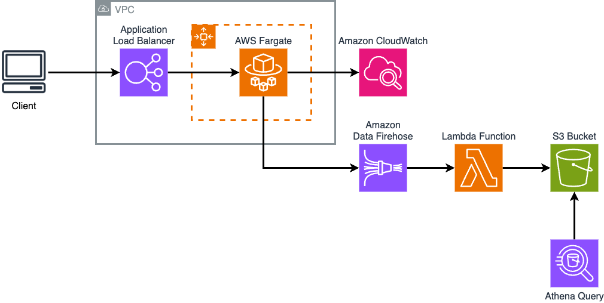

# Claude Code Analytics Pipeline

This directory contains the CloudFormation templates for setting up an analytics pipeline to track Claude Code usage metrics.

## Overview

The analytics pipeline consists of:

- **Kinesis Data Firehose**: Streams CloudWatch Logs to S3 in Parquet format
- **S3 Data Lake**: Stores historical metrics data with automatic archival
- **AWS Athena**: Enables SQL queries on the metrics data
- **Partition Projection**: Eliminates the need for Glue crawlers



## Deployment

### Prerequisites

1. AWS CLI configured with appropriate credentials
2. Claude Code OTEL collector already deployed and sending metrics to CloudWatch Logs

### Deploy the Analytics Pipeline

```bash
# Deploy the analytics pipeline
aws cloudformation deploy \
  --template-file analytics-pipeline.yaml \
  --stack-name claude-code-analytics \
  --capabilities CAPABILITY_IAM

# Get the Athena console URL
aws cloudformation describe-stacks \
  --stack-name claude-code-analytics \
  --query 'Stacks[0].Outputs[?OutputKey==`AthenaConsoleUrl`].OutputValue' \
  --output text
```

### Update the Monitoring Dashboard

```bash
# Update the dashboard to remove hard-coded users
aws cloudformation deploy \
  --template-file monitoring-dashboard.yaml \
  --stack-name claude-code-auth-dashboard \
  --parameter-overrides TokenCostPerMillion=15.0
```

## Using Athena for User Analytics

### Access Athena Console

1. Navigate to the Athena console URL provided in the stack outputs
2. Select the workgroup created by the stack (e.g., `claude-code-analytics-workgroup`)
3. Select the database (e.g., `claude_code_analytics_analytics`)
4. Access the saved queries from the "Saved queries" tab in the Athena console

### Pre-Built Named Queries

The stack automatically creates 10 named queries associated with your workgroup. These queries provide comprehensive analytics capabilities:

#### 1. Top Users by Token Usage
Identifies your top 10 users by token consumption over the last 7 days, including user email, organization, session count, and estimated costs.

**Use Case:** Understand who your power users are and track usage patterns.

#### 2. Token Usage by Model and Type
Analyzes token usage patterns across different models (Opus, Sonnet, Haiku) and token types (input/output) with cost estimates.

**Use Case:** Optimize model selection and understand cost distribution.

#### 3. User Activity Pattern
Shows user activity patterns by hour of day to identify peak usage times.

**Use Case:** Capacity planning and understanding when your users are most active.

#### 4. Token Usage by Organization
Tracks token usage across different organizations with user counts and cost attribution.

**Use Case:** Organizational billing and chargeback.

#### 5. Token Usage by Email Domain
Analyzes usage patterns by email domain to understand user demographics.

**Use Case:** Identify which teams or departments are using the service.

#### 6. Detailed TPM and RPM Analysis
Calculates tokens per minute (TPM) and requests per minute (RPM) metrics for rate limit monitoring.

**Use Case:** Monitor API usage patterns and prevent rate limiting issues.

#### 7. User Session Analysis
Analyzes user sessions including duration, intensity, models used, and per-session costs.

**Use Case:** Understand user behavior and session patterns.

#### 8. Detailed Cost Attribution
Provides precise cost calculations by user, organization, and model with cumulative tracking.

**Use Case:** Accurate billing and cost management.

#### 9. Peak Usage and Rate Limit Analysis
Identifies peak usage periods and highlights when you're approaching rate limits.

**Use Case:** Proactive monitoring to prevent service disruptions.

#### 10. Usage Analysis by Identity Provider
Compares usage patterns across different identity providers (Okta, Auth0, Cognito).

**Use Case:** Understand usage by authentication method.

### Working with the Queries

Once you've selected your workgroup and database in the Athena console:

1. **Access Saved Queries**: Click on the "Saved queries" tab
2. **Load a Query**: Select any of the 10 pre-built queries to load it into the query editor
3. **Run the Query**: Click "Run" to execute the query with your current data
4. **Export Results**: Download results as CSV for further analysis

### Customizing Queries

#### Adjusting Time Ranges

Modify the WHERE clause in any query to change the time range:

```sql
-- Last 24 hours
WHERE from_unixtime(timestamp/1000) >= CURRENT_TIMESTAMP - INTERVAL '24' HOUR

-- Last 7 days
WHERE year >= YEAR(CURRENT_DATE - INTERVAL '7' DAY)
    AND from_unixtime(timestamp/1000) >= CURRENT_TIMESTAMP - INTERVAL '7' DAY

-- Last 30 days
WHERE year >= YEAR(CURRENT_DATE - INTERVAL '30' DAY)
    AND from_unixtime(timestamp/1000) >= CURRENT_TIMESTAMP - INTERVAL '30' DAY

-- Specific date range
WHERE from_unixtime(timestamp/1000) BETWEEN TIMESTAMP '2024-01-01' AND TIMESTAMP '2024-01-31'
```

#### Filtering by Specific Users or Organizations

Add additional WHERE conditions to focus on specific users:

```sql
-- Filter by email domain
AND user_email LIKE '%@example.com'

-- Filter by organization
AND organization_id = 'your-org-id'

-- Filter by specific model
AND model LIKE '%opus%'
```

## Data Retention

- **S3 Standard**: 90 days (configurable via `DataRetentionDays` parameter)
- **S3 Glacier**: After 90 days (automatic transition)
- **Athena Query Results**: 7 days (auto-deleted)

## Cost Optimization

1. **Partition Projection**: No need to run Glue crawlers
2. **Parquet Format**: Columnar storage reduces query costs
3. **S3 Lifecycle**: Automatic archival to Glacier
4. **Query Result Caching**: Athena caches results for 7 days

### Query Performance

- Use partition columns (year, month, day, hour) in WHERE clauses
- Limit time ranges to reduce data scanned
- Use LIMIT for exploratory queries
