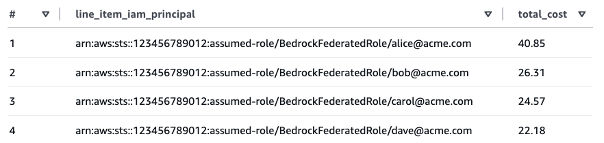

# Cost Attribution for Amazon Bedrock

This applies to the **direct IAM path** (`FederationType=direct`) only. The Cognito path handles cost attribution automatically.

---

## 1. Built-in per-user tracking (no IdP changes required)

The credential provider embeds the user's email in the STS session name, so the resulting principal ARN looks like:

```
arn:aws:sts::123456789012:assumed-role/app-role/alice@acme.com
```

This ARN automatically appears in the `line_item_iam_principal` column of CUR 2.0 when IAM principal data is enabled. **This is the default behavior — no IdP changes or tag configuration required.**

### Enable IAM principal data in CUR 2.0

1. Open the Billing and Cost Management console → **Data Exports**
2. Create or edit a Standard data export (CUR 2.0)
3. Under **Additional export content**, enable **"Include caller identity (IAM principal) allocation data"**

The following example shows per-user Bedrock costs queried from CUR 2.0 data using Athena:



Each user's email is visible in the `line_item_iam_principal` column, enabling per-user cost visibility without any IdP changes or tag configuration.

> **Note:** `line_item_iam_principal` is available in CUR 2.0 data and can be queried using tools like Athena or QuickSight. Cost Explorer does not expose this column as a filter or grouping dimension. To see per-user costs in Cost Explorer, configure session tags as described in [section 3](#3-optional-session-tags-for-richer-per-user-attribution).

---

## 2. IAM principal tags for team/department-level attribution

Tags applied to IAM principals (users or roles) in the IAM console appear in CUR 2.0 with the `iamPrincipal/` prefix (e.g., `iamPrincipal/department`, `iamPrincipal/cost-center`). In this solution all federated users share the same role, so role-level tags are useful for team or department attribution but cannot distinguish between individual users.

To set this up:

1. In the IAM console, tag the federation role with organizational tags (e.g., `department`, `cost-center`)
2. In the Billing and Cost Management console → **Cost Allocation Tags**, filter for **IAM principal type** tags, select the desired tags, and click **Activate**
3. Tags only appear after the role has made at least one Bedrock API call, and take up to **24 hours to appear** and a further **24 hours to activate**

---

## 3. Optional: session tags for richer per-user attribution

If you need per-user **tag-based** cost allocation (beyond the session name in the ARN), you can embed session tags in the ID token.

When `AssumeRoleWithWebIdentity` is called, STS reads the `https://aws.amazon.com/tags` claim from the ID token and attaches those tags to the resulting session. Once activated as **user-defined cost allocation tags** (not the "IAM principal type" filter), they appear in CUR 2.0 and Cost Explorer.

### Trust policy requirement

The IAM role's trust policy must include `sts:TagSession` in addition to `sts:AssumeRoleWithWebIdentity`. Without it, the `AssumeRoleWithWebIdentity` call fails entirely with an `AccessDenied` error — STS does not silently ignore the tags.

### Claim format

Your IdP must add the `https://aws.amazon.com/tags` claim to the ID token. Two formats are accepted by STS:

- **Nested object** (Auth0): tag values are single-element arrays inside a `principal_tags` object.
- **Flattened per-key claims** (Okta, Entra ID): one claim per tag, with plain string values and JSON Pointer-encoded paths.

Nested object format (Auth0):

```json
{
  "principal_tags": {
    "UserEmail": ["alice@acme.com"],
    "UserId":    ["user-internal-id"]
  },
  "transitive_tag_keys": ["UserEmail", "UserId"]
}
```

### Auth0

Add a post-login Action that sets the claim:

```javascript
exports.onExecutePostLogin = async (event, api) => {
  api.idToken.setCustomClaim('https://aws.amazon.com/tags', {
    principal_tags: {
      UserEmail: [event.user.email],
      UserId:    [event.user.user_id],
    },
    transitive_tag_keys: ['UserEmail', 'UserId'],
  });
};
```

### Okta

Okta's Expression Language cannot produce a JSON object value directly. Use an [Okta inline token hook](https://developer.okta.com/docs/guides/token-inline-hook/) with `com.okta.identity.patch` operations to inject the flattened per-key claim format. URI-style claim names must be JSON Pointer-encoded: `/` becomes `~1`, so `https://aws.amazon.com/tags` as a patch path becomes `https:~1~1aws.amazon.com~1tags`.

Your token hook endpoint must return:

```json
{
  "commands": [{
    "type": "com.okta.identity.patch",
    "value": [
      {
        "op": "add",
        "path": "/claims/https:~1~1aws.amazon.com~1tags~1principal_tags~1UserEmail",
        "value": "alice@acme.com"
      },
      {
        "op": "add",
        "path": "/claims/https:~1~1aws.amazon.com~1tags~1principal_tags~1UserId",
        "value": "user-internal-id"
      },
      {
        "op": "add",
        "path": "/claims/https:~1~1aws.amazon.com~1tags~1transitive_tag_keys",
        "value": ["UserEmail", "UserId"]
      }
    ]
  }]
}
```

> **Note:** AWS requires `transitive_tag_keys` to be an array of strings. Okta's hook schema formally types `value` as a scalar string, so array support depends on runtime behavior — test this against your Okta org. If Okta rejects the array, mark only the tag key you need in Cost Explorer (e.g., `"UserEmail"`) and accept that the other key will not propagate to child sessions.

Refer to the [token inline hook reference](https://developer.okta.com/docs/reference/token-hook/) for the full request/response schema.

### Microsoft Entra ID

Entra ID's custom claims provider does not support JSON object values (only `String` and `String array`), so use the [flattened STS claim format](https://docs.aws.amazon.com/IAM/latest/UserGuide/id_session-tags.html) via a [custom claims provider](https://learn.microsoft.com/en-us/entra/identity-platform/custom-claims-provider-overview) backed by an Azure Function. The function must return:

```json
{
  "data": {
    "@odata.type": "microsoft.graph.onTokenIssuanceStartResponseData",
    "actions": [
      {
        "@odata.type": "microsoft.graph.tokenIssuanceStart.provideClaimsForToken",
        "claims": {
          "https://aws.amazon.com/tags/principal_tags/UserEmail": "alice@acme.com",
          "https://aws.amazon.com/tags/principal_tags/UserId":    "object-id-from-entra",
          "https://aws.amazon.com/tags/transitive_tag_keys":      ["UserEmail", "UserId"]
        }
      }
    ]
  }
}
```

### Activate session tags as cost allocation tags

After at least one Bedrock API call has been made with session tags:

1. Open **Billing and Cost Management console → Cost Allocation Tags**
2. Filter for **user-defined** cost allocation tags (not "IAM principal type" — that is for section 2 role-level tags)
3. Locate `UserEmail` and `UserId` and click **Activate** — tags take up to **24 hours to appear** after the first tagged API call, and a further **24 hours to activate**
4. In Cost Explorer, group or filter by **Tag → `UserEmail`** to see per-user Bedrock spend

Once activated, session tags are available in both **Cost Explorer** and **CUR 2.0**. This means you can group or filter costs by tag in the Cost Explorer console without needing Athena, unlike the `line_item_iam_principal` column in section 1 which is only available in CUR 2.0.

With session tags configured, you can also group costs by department or any other tag dimension. The following example shows department-level Bedrock costs queried from CUR 2.0 data using Athena:


