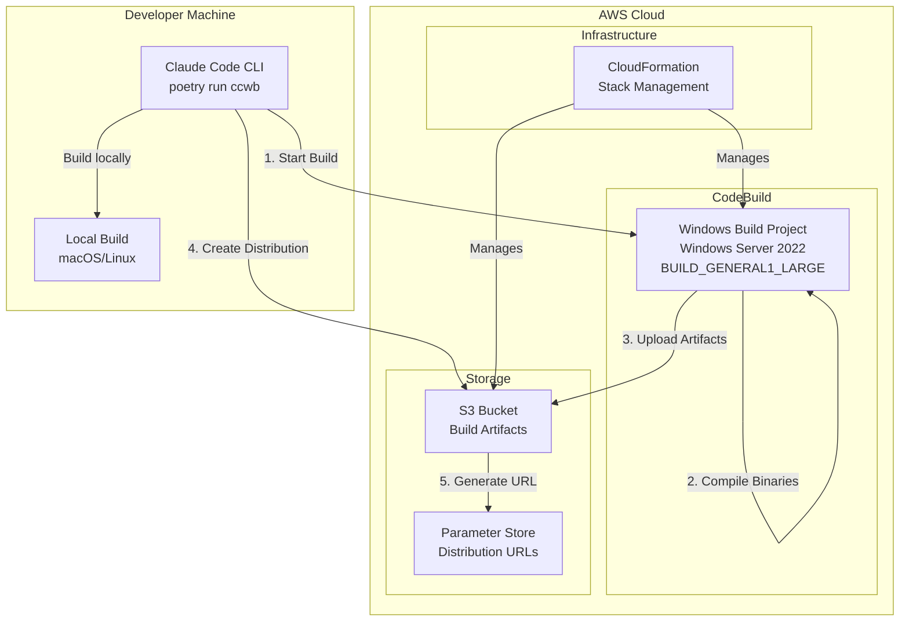
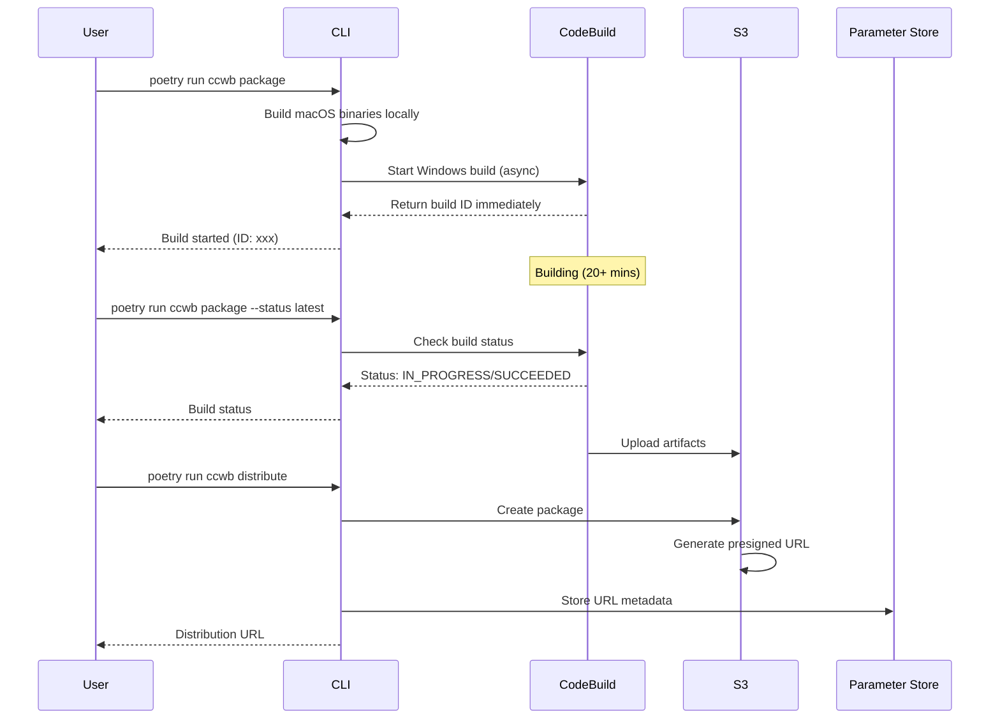
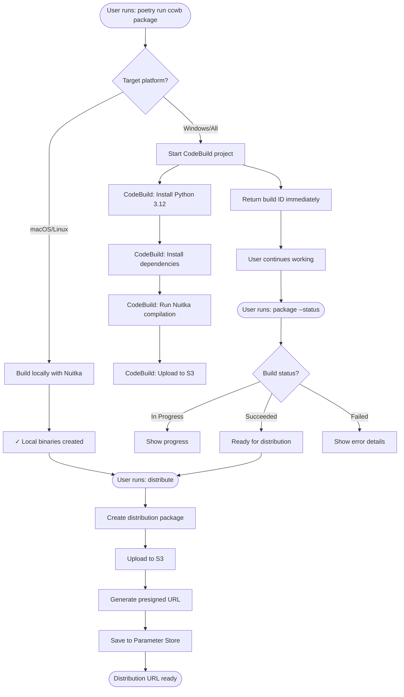

# Windows Build System Documentation

## Table of Contents

1. [Overview](#overview)
2. [Architecture](#architecture)
3. [Prerequisites](#prerequisites)
4. [Initial Setup](#initial-setup)
5. [Build Process](#build-process)
6. [CLI Commands](#cli-commands)
7. [Distribution](#distribution)
8. [Troubleshooting](#troubleshooting)
9. [Technical Details](#technical-details)

## Overview

The Windows build system enables IT administrators to create native Windows executables for Claude Code authentication tools. Due to Nuitka's requirement for native compilation on target platforms, Windows binaries must be built on Windows systems. This is accomplished using AWS CodeBuild with Windows Server 2022 containers.

### Key Features

- **Cross-platform support**: Builds Windows, macOS, and Linux binaries
- **Asynchronous builds**: Non-blocking build process with status tracking
- **Secure distribution**: Time-limited presigned URLs for package distribution
- **Automated compilation**: Uses Nuitka for Python-to-native compilation
- **No manual intervention**: Fully automated through CLI commands

## Architecture

### System Components



### Build Flow Sequence



## Prerequisites

### Local Requirements

- Python 3.10, 3.11, or 3.12 (not 3.13+)
- Poetry package manager
- AWS CLI v2 configured
- Git

### AWS Requirements

- AWS account with appropriate IAM permissions
- Ability to create CloudFormation stacks
- Permissions for:
  - CodeBuild projects
  - S3 buckets
  - Systems Manager Parameter Store
  - CloudWatch Logs

## Initial Setup

### 1. Clone Repository

```bash
git clone <repository-url>
cd guidance-for-claude-code-with-amazon-bedrock/source
```

### 2. Install Dependencies

```bash
poetry install
```

### 3. Initialize Configuration

```bash
poetry run ccwb init
```

During initialization, you'll be prompted for:

- Identity provider domain (e.g., `us-east-1xxxxx.auth.us-east-1.amazoncognito.com`)
- Client ID from your identity provider
- AWS region for deployment
- Cross-region Bedrock access configuration
- **Enable CodeBuild for Windows binary builds? [Y/n]** - Select Yes
- Monitoring preferences

### 4. Deploy Infrastructure

```bash
poetry run ccwb deploy
```

This creates the following CloudFormation stacks:

- **Authentication stack**: IAM roles, identity pool
- **Networking stack**: VPC and subnets (if monitoring enabled)
- **Monitoring stack**: OpenTelemetry collector (optional)
- **CodeBuild stack**: Windows build project
- **Dashboard stack**: CloudWatch dashboard (optional)
- **Analytics stack**: Athena and Kinesis (optional)

### 5. Verify CodeBuild Deployment

```bash
poetry run ccwb status
```

Verify CodeBuild is deployed:

```
CodeBuild Stack:
• Status: CREATE_COMPLETE
• Project: claude-code-auth-windows-build
• S3 Bucket: claude-code-auth-codebuild-buildbucket-xxxxx
```

## Build Process

### Starting a Build

The package command now operates asynchronously by default:

```bash
poetry run ccwb package
```

Output:

```
Fetching deployment information...
╭─────────────────────────────────────────────────────────────╮
│                                                             │
│  Package Builder                                            │
│                                                             │
│  Creating distribution package for                          │
│  us-east-1xxxxx.auth.us-east-1.amazoncognito.com           │
│                                                             │
╰─────────────────────────────────────────────────────────────╯

Package Configuration:
  Configuration Profile: default
  AWS Profile: ClaudeCode
  OIDC Provider: us-east-1xxxxx.auth.us-east-1.amazoncognito.com
  Client ID: 3k67m9eb6c78o2tgnk7hjhd169
  AWS Region: us-east-1
  Identity Pool: us-east-1:1a794053-7af4-444d-b2cd-c35f22daecca
  Claude Model: Claude Opus 4.1
  Source Region: us-west-2
  Bedrock Regions: US Cross-Region (us-east-1, us-east-2, us-west-2)

Building package...
✓ Building credential process for macos...
✓ Building OTEL helper for macos...

Build ID: claude-code-auth-windows-build:abc123-def456-789
Estimated cost: ~$0.10

Windows build started!
Build will take approximately 12-15 minutes to complete.

To check status:
  poetry run ccwb package --status claude-code-auth-windows-build:abc123-def456-789

To view logs in AWS Console:
  https://console.aws.amazon.com/codesuite/codebuild/projects/claude-code-auth-windows-build/build/abc123-def456-789
```

### Checking Build Status

Check the latest build:

```bash
poetry run ccwb package --status latest
```

Check a specific build:

```bash
poetry run ccwb package --status claude-code-auth-windows-build:abc123-def456-789
```

Status outputs:

```
⏳ Build in progress
Phase: BUILD
Elapsed: 5 minutes

✓ Build succeeded!
Duration: 13 minutes
Artifacts are ready. Run the following to complete packaging:
poetry run ccwb package --complete

✗ Build failed
Failed in phase: BUILD
```

### Listing Recent Builds

```bash
poetry run ccwb builds
```

Output:

```
               Recent Builds for claude-code-auth-windows-build
┏━━━━━━━━━━┳━━━━━━━━━━━━━━━━┳━━━━━━━━━━━━━━━━━━┳━━━━━━━━━━┳━━━━━━━━━━━┓
┃ Build ID ┃ Status         ┃ Started          ┃ Duration ┃ Phase     ┃
┡━━━━━━━━━━╇━━━━━━━━━━━━━━━━╇━━━━━━━━━━━━━━━━━━╇━━━━━━━━━━╇━━━━━━━━━━━┩
│ abc12345 │ ✓ Succeeded    │ 2024-08-24 10:30 │ 13 min   │ COMPLETED │
│ def67890 │ ✓ Succeeded    │ 2024-08-24 09:15 │ 12 min   │ COMPLETED │
│ ghi11111 │ ✗ Failed       │ 2024-08-24 08:00 │ 2 min    │ BUILD     │
└──────────┴────────────────┴──────────────────┴──────────┴───────────┘
```

## CLI Commands

### Package Command

**Basic usage:**

```bash
poetry run ccwb package [options]
```

**Options:**
| Option | Description | Default |
|--------|-------------|---------|
| `--target-platform` | Platform to build for (macos/linux/windows/all) | all |
| `--profile` | Configuration profile to use | default |
| `--distribute` | Create distribution after build | false |
| `--expires-hours` | Distribution URL expiration (1-168) | 48 |
| `--status` | Check build status (build-id or "latest") | - |

**Examples:**

Build all platforms (returns immediately for Windows):

```bash
poetry run ccwb package
```

Build and distribute:

```bash
poetry run ccwb package --distribute
```

Check status:

```bash
poetry run ccwb package --status latest
```

### Builds Command

**Basic usage:**

```bash
poetry run ccwb builds [options]
```

**Options:**
| Option | Description | Default |
|--------|-------------|---------|
| `--limit` | Number of builds to show | 10 |
| `--project` | CodeBuild project name | auto-detect |

### Distribute Command

**Basic usage:**

```bash
poetry run ccwb distribute [options]
```

**Options:**
| Option | Description | Default |
|--------|-------------|---------|
| `--get-latest` | Get existing URL without creating new | false |
| `--expires-hours` | URL expiration time (1-168) | 48 |
| `--package-path` | Path to package directory | dist |
| `--allowed-ips` | IP restrictions (comma-separated) | - |
| `--qr` | Generate QR code | false |

**Examples:**

Create new distribution:

```bash
poetry run ccwb distribute
```

Get existing URL:

```bash
poetry run ccwb distribute --get-latest
```

## Distribution

### Package Contents

The distribution package (`dist/`) contains:

```
dist/
├── credential-process-windows.exe      # Windows auth binary (~28 MB)
├── credential-process-macos-arm64      # macOS ARM64 binary (~26 MB)
├── otel-helper-windows.exe            # Windows telemetry helper (~28 MB)
├── otel-helper-macos-arm64            # macOS telemetry helper (~26 MB)
├── config.json                        # Configuration with Cognito settings
├── install.sh                         # macOS/Linux installer script
├── install.bat                        # Windows installer script
├── README.md                          # Installation instructions
└── .claude/
    └── settings.json                  # Claude Code telemetry settings
```

### End User Installation

**Windows:**

```batch
REM Download the package
curl -L -o claude-code-package.zip "<presigned-url>"

REM Extract
tar -xf claude-code-package.zip

REM Install
cd dist
install.bat
```

**macOS/Linux:**

```bash
# Download the package
curl -L -o claude-code-package.zip "<presigned-url>"

# Extract
unzip claude-code-package.zip

# Install
cd dist
./install.sh
```

The installer will:

1. Create `~/claude-code-with-bedrock/` directory
2. Copy binaries to the directory
3. Configure AWS CLI profile named `ClaudeCode`
4. Test authentication

## Troubleshooting

### Common Build Issues

#### 1. Build Fails Immediately

**Error:** "The Python version '3.12' is not supported by Nuitka '2.0'"
**Solution:** This has been fixed - we now use Nuitka 2.7.12 which supports Python 3.12

#### 2. Build Times Out

**Error:** "Build timed out after 20 minutes"
**Solution:** Normal build time is 12-15 minutes. Check CodeBuild logs for compilation errors.

#### 3. No Artifacts Found

**Error:** "no matching artifact paths found"
**Solution:** Check that the build phase completed successfully:

```bash
aws logs tail /aws/codebuild/claude-code-auth-windows-build --region us-east-1 --since 30m
```

#### 4. PowerShell Syntax Errors

**Error:** "The term 'SET' is not recognized"
**Solution:** CodeBuild uses PowerShell, not CMD. The buildspec has been updated to use PowerShell syntax.

### Checking Build Logs

**Via AWS CLI:**

```bash
# Get recent logs
aws logs tail /aws/codebuild/claude-code-auth-windows-build \
  --region us-east-1 \
  --since 30m

# Search for errors
aws logs filter-log-events \
  --log-group-name /aws/codebuild/claude-code-auth-windows-build \
  --region us-east-1 \
  --filter-pattern "ERROR"
```

**Via Console:**
The package command provides a direct link to the AWS Console for each build.

## Technical Details

### Windows Build Environment

**CodeBuild Configuration:**

- **Environment Type:** `WINDOWS_SERVER_2022_CONTAINER`
- **Compute Type:** `BUILD_GENERAL1_LARGE` (4 vCPUs, 8 GB memory)
- **Base Image:** `aws/codebuild/windows-base:2022-1.0`
- **Timeout:** 30 minutes
- **Region:** us-east-1 (hardcoded for consistency)

### Software Versions

**Build Environment:**

- Windows Server 2022
- Python 3.12.10 (installed via Chocolatey)
- Nuitka 2.7.12
- pip 24.x

**Dependencies installed during build:**

- nuitka==2.7.12
- ordered-set
- zstandard
- boto3
- requests
- PyJWT
- keyring
- cryptography
- questionary
- rich
- cleo
- pydantic
- pyyaml

### Nuitka Compilation Settings

```bash
C:\Python312\python.exe -m nuitka \
  --standalone \                    # Include all dependencies
  --onefile \                      # Single executable file
  --assume-yes-for-downloads \      # Auto-download requirements
  --windows-disable-console \       # No console window popup
  --company-name="Claude Code" \
  --product-name="Claude Code Credential Process" \
  --file-version="1.0.0.0" \
  --product-version="1.0.0.0" \
  --windows-file-description="AWS Credential Process for Claude Code" \
  --output-filename=credential-process-windows.exe \
  --output-dir=. \
  --remove-output \                # Clean up build artifacts
  source/credential_provider/__main__.py
```

### Build Performance

**Typical build times:**

- macOS ARM64 (local): ~30 seconds
- Windows (CodeBuild): 12-15 minutes
  - Install phase: ~1 minute
  - Pre-build (dependencies): ~2 minutes
  - Build (Nuitka compilation): ~10-12 minutes
  - Post-build: ~30 seconds

**Optimization history:**

1. Initial: PyInstaller, MEDIUM instance → 16+ minutes
2. Nuitka 2.0.0, MEDIUM instance → Failed (Python 3.12 incompatible)
3. Nuitka 2.7.12, LARGE instance → 12-13 minutes (current)
4. Attempted 2XLARGE → Not supported for Windows containers

### Security

**S3 Bucket:**

- Private bucket with versioning enabled
- Server-side encryption (SSE-S3)
- Lifecycle rules for old packages (90 days)

**Presigned URLs:**

- Default expiration: 48 hours
- Maximum expiration: 168 hours (7 days)
- Optional IP restrictions via bucket policy

**IAM Permissions Required:**

```json
{
  "Version": "2012-10-17",
  "Statement": [
    {
      "Effect": "Allow",
      "Action": [
        "codebuild:StartBuild",
        "codebuild:BatchGetBuilds",
        "codebuild:ListBuildsForProject"
      ],
      "Resource": "arn:aws:codebuild:us-east-1:*:project/claude-code-auth-windows-build"
    },
    {
      "Effect": "Allow",
      "Action": ["s3:PutObject", "s3:GetObject", "s3:ListBucket"],
      "Resource": [
        "arn:aws:s3:::claude-code-auth-codebuild-buildbucket-*",
        "arn:aws:s3:::claude-code-auth-codebuild-buildbucket-*/*"
      ]
    },
    {
      "Effect": "Allow",
      "Action": ["ssm:PutParameter", "ssm:GetParameter"],
      "Resource": "arn:aws:ssm:*:*:parameter/claude-code/*"
    }
  ]
}
```

### Cost Analysis

**Per build:**

- CodeBuild: ~$0.10 (13 minutes × $0.005/minute for LARGE instance)
- S3 storage: ~$0.01 (100 MB stored)
- Data transfer: Varies by downloads

**Monthly estimate (daily builds):**

- 30 builds × $0.10 = $3.00 CodeBuild
- Storage: ~$0.50
- **Total: ~$3.50/month**

### File System Locations

**Source files:**

```
/source/
├── credential_provider/
│   └── __main__.py           # Main authentication module
├── otel_helper/
│   └── __main__.py           # Telemetry helper module
├── claude_code_with_bedrock/
│   └── cli/
│       └── commands/
│           ├── package.py    # Package build logic
│           ├── builds.py     # Build listing logic
│           └── distribute.py # Distribution logic
└── deployment/
    └── infrastructure/
        └── codebuild-windows.yaml  # CodeBuild CloudFormation
```

**Build artifacts:**

```
~/.claude-code/
└── latest-build.json         # Latest build metadata

dist/                         # Local package output
└── [platform binaries]

S3: claude-code-auth-codebuild-buildbucket-xxxxx/
├── windows-binaries.zip      # Windows build artifacts
└── packages/
    └── YYYYMMDD-HHMMSS/
        └── claude-code-package-*.zip
```

## Appendix

### Complete Build Process Flow



### Quick Reference Card

```bash
# Daily workflow
poetry run ccwb package                    # Start build (async)
poetry run ccwb builds                     # Check recent builds
poetry run ccwb package --status latest    # Check if done
poetry run ccwb distribute                 # Create distribution

# Get existing URL (no rebuild)
poetry run ccwb distribute --get-latest

# Debug failed build
poetry run ccwb package --status latest
aws logs tail /aws/codebuild/claude-code-auth-windows-build --region us-east-1

# Extended distribution (7 days)
poetry run ccwb distribute --expires-hours 168
```

---

_Last updated: August 2024_
_Version: 1.0.0_
