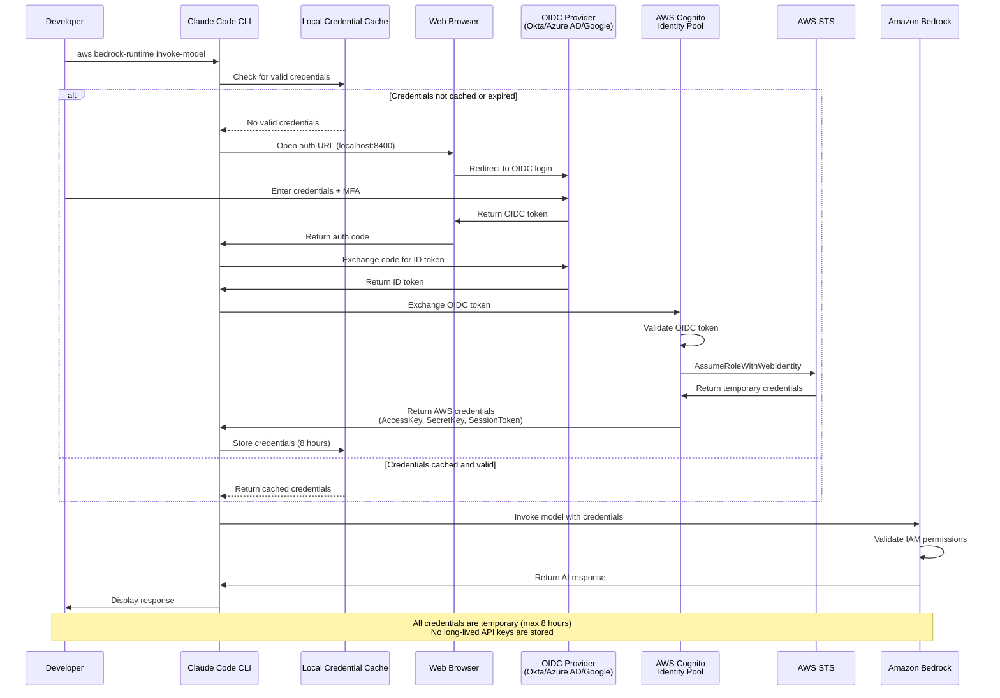
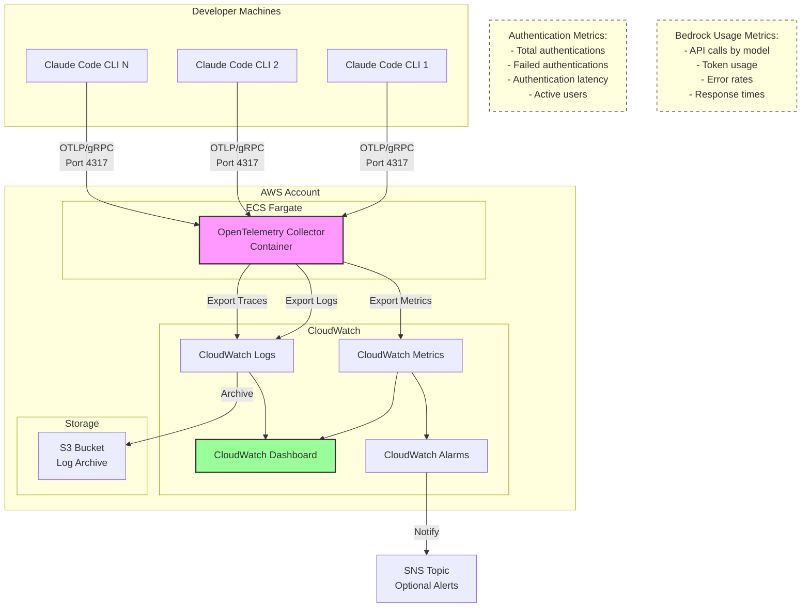

# Architecture Diagrams

## 1. Authentication and Credential Flow

This diagram shows the complete process for obtaining temporary AWS credentials and using them to access Amazon Bedrock.

## 2. OpenTelemetry Monitoring Architecture

This diagram illustrates the optional monitoring setup using OpenTelemetry collector on ECS Fargate.

## AWS Architecture Icon Requirements

For official AWS architecture diagrams (PNG format):
- Use latest AWS Architecture Icons Toolkit (light background, released 04.28.2023)
- Service icons ≥0.4"×0.4", grouping icons ≥0.3"×0.3"
- All icons must have labels at bottom, Arial 9-12pt in black
- "AWS" or "Amazon" appears in same line as first word of service
- Solid black arrows (1.25pt width), no diagonal lines
- No cropping, flipping, or shape modifications allowed

## Key Architecture Components

1. **Developer Workstation**: Runs Claude Code CLI with local credential caching
2. **OIDC Provider**: Enterprise identity provider (Okta, Azure AD, Google Workspace)
3. **Amazon Cognito Identity Pool**: Validates OIDC tokens and manages identity federation
4. **AWS STS**: Issues temporary credentials via AssumeRoleWithWebIdentity
5. **Amazon Bedrock**: Target AI service accessed with temporary credentials
6. **AWS CloudTrail**: Captures all authentication and API access events
7. **Amazon CloudWatch**: Optional monitoring dashboard and alerting
8. **Amazon ECS Fargate**: Hosts OpenTelemetry collector for centralized telemetry